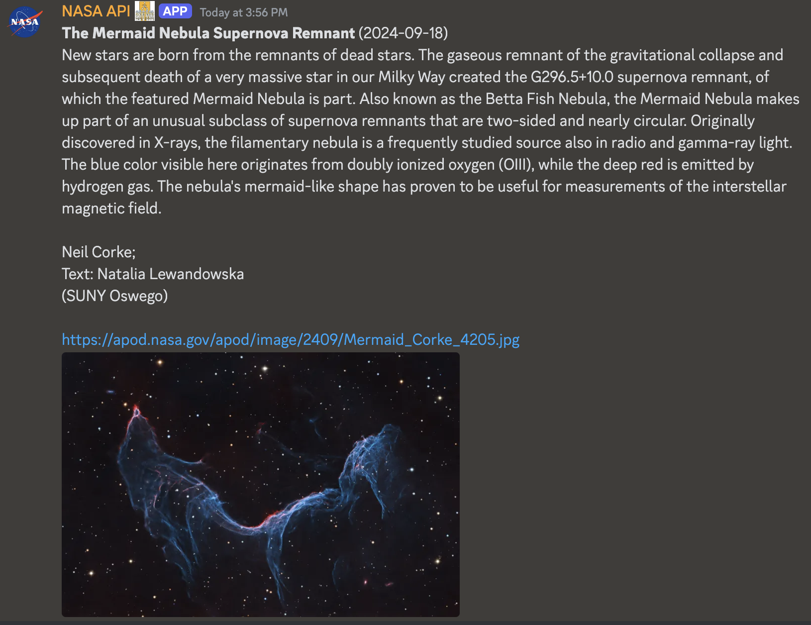

# nasabot

Discord bot to interact with https://api.nasa.gov!

## Example

```
> ./nasabot apod 
```



## Getting started

### Host your own nasabot

```bash
$ docker build -t nasabot-docker .
$ docker run -e NASA_API_TOKEN -e DISCORD_BOT_API_TOKEN -t nasabot-docker
```

Note: Both discord.js and api.nasa.gov require an API token to interact with their
systems. This information is passed to the application via the environment. You can find
detailed descriptions about these fields in [assets/envvars.csv](envvars.csv).

### Add nasabot to your server 

If you don't want to host your own instance, feel free to use mine!
[link](https://discord.com/oauth2/authorize?client_id=701258422498099200)
